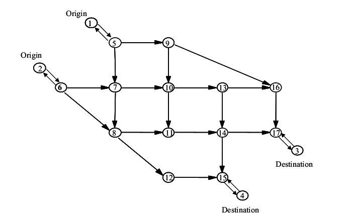

# NOTICE

THIS REPOSITORY WILL BE REWRITTEN SOON X)

# USER-EQUILIBRIUM-SOLUTION #

User equilibrium is a classical problem on the traffic flow distribution in the field of Trasportation Engineering, its main idea is: Every driver cannot reduce his travel time by unilaterally change his travel route. My professor mentioned that this is also derived from the [Nash Equilibrium](https://en.wikipedia.org/wiki/Nash_equilibrium), but I am sorry that at this time I know nothing about Game Theory.

Note: the mathematical formulars cannot be displayed correctly in the website. If you are interested in the theory part, please read the [User-Equilibrium-Solution.pdf](/README.pdf).

## PART I INSTRUCTIONS ##

1. Use the `create_template.py` to build a template Excel file. Before running it, you're supposed to revise the file location to where you want to save it. Remember that all the data will be read from this template later.
2. Fill in the template with your own data. Please follow the given format, or the program may not function well.  Moreover, the road network can NOT contain a loop. (Now there is no code to detect if  there exists a loop in the network graph, but I hope that I could add it soon)
3. Revise the data file (the template) location and accuracy parameters in the *main.py* as your prefer. However, do NOT let the accuracy of convex program's solution too small, or the Franke-Wolfe Algorithm can not converge.
4. Run the `main.py`, then analyze the output.

## PART II PRINCIPLES ##

Please read this part in [User-Equilibrium-Solution.pdf](/README.pdf).

## PART III EXAMPLES ##

In the file `create_template.py`, there is a good example. The graph is as follows:

The basic data of this network is given as a table:

We are also supposed to input the information of demand into the program:

Then, we can follow the instructions and run the program, then yield the output we expect.